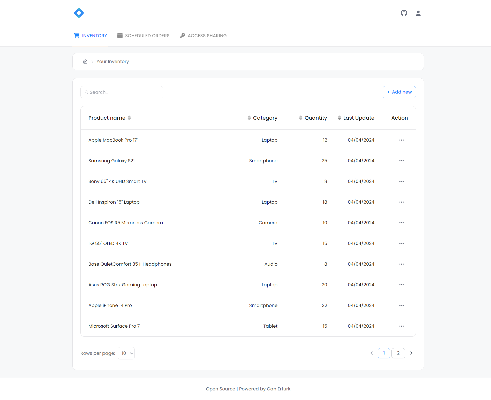

# MERN Stack Inventory Management App

## About this project

This project is a full-stack project developed for users to manage their product inventory. In this project, users can store the products they have, enter orders for products that will arrive or leave at a later date, and share inventory access with each other.

I handled both the design and development process together and used technologies like MUI, Headless UI, Framer Motion, Redux Toolkit and Zustand in the front-end.

You can view this project in my portfolio by clicking the link below.

[https://canerturk.dev/project/inventory-management](https://canerturk.dev/project/inventory-management)

## API Documentation

I've created a simple documentation for the API endpoints & their parameters with examples. You can take a look at the API documentation [here](https://github.com/can-erturk/inventory-management/blob/main/backend/README.md).

## Installation

### Back-end installation:

> 1.  First, you should create your own database and then get a MongoDB URI (connection string) to connect to it.
> 2.  Create an `.env` file in the backend directory, and fill it to fit the example given [here](https://github.com/can-erturk/inventory-management/blob/main/backend/.env.example). (The `FRONTEND_BASE_URL` is will be defined after front-end installation.)
> 3.  Open your terminal and navigate to the backend directory.
> 4.  Run `npm install && npm run dev` command.
> 5.  Copy the URL that appears in your console.

### Front-end installation:

> 1.  Create an `.env` file in the frontend directory, and fill it to fit the example given [here](https://github.com/can-erturk/inventory-management/blob/main/frontend/.env.example). You should use the URL you copied from the console before.
> 2.  Open your terminal again, and navigate to the frontend directory.
> 3.  Run `npm install && npm run dev` command.
> 4.  Copy the URL that appears in your console. Then paste it into your backend `.env` file as `FRONTEND_BASE_URL`.

## Licence

This project is released under the MIT License. For license details, see the [LICENSE](https://github.com/can-erturk/inventory-management/blob/main/LICENCE) file.

## Live preview & demo

[Click here](https://mern-products.vercel.app/) to see live preview.

